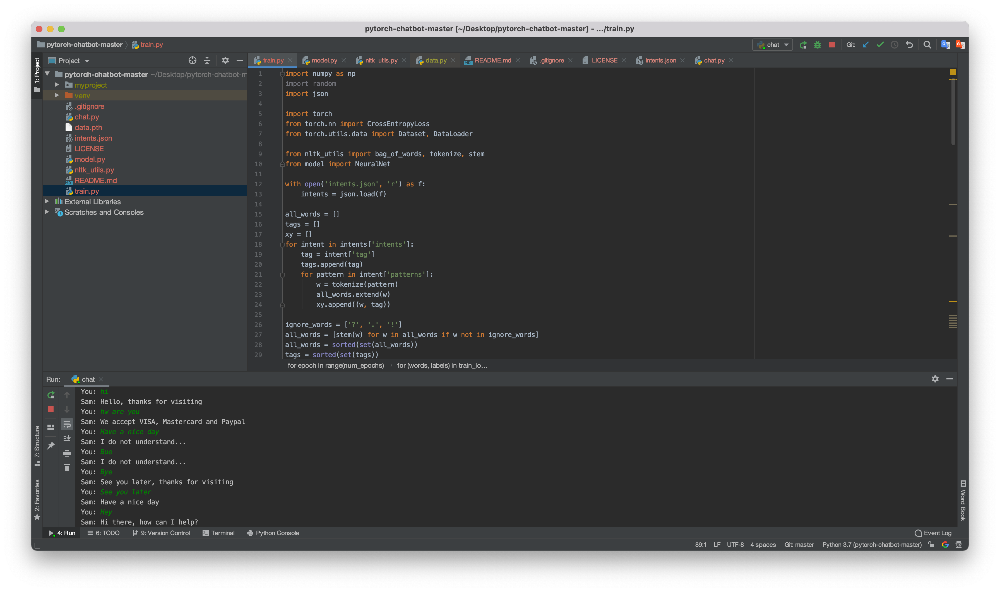

# Implementation of a Contextual Chatbot in PyTorch.  
Simple chatbot implementation with PyTorch. 


### Create an environment

```console
mkdir myproject
$ cd myproject
$ python3 -m venv venv
```

### Activate it
Mac / Linux:
```console
. venv/bin/activate
```


How to run our project 
```console
python train.py
```
This will dump `data.pth` file. And then run
```console
python chat.py
```
## Customize
Have a look at [intents.json](intents.json). People can costumize project by own
```console
{
  "intents": [
    {
      "tag": "greeting",
      "patterns": [
        "Hi",
        "Hey",
        "How are you",
        "Is anyone there?",
        "Hello",
        "Good day"
      ],
      "responses": [
        "Hey :-)",
        "Hello, thanks for visiting",
        "Hi there, what can I do for you?",
        "Hi there, how can I help?"
      ]
    },
    ...
  ]
}
```
#Photo

